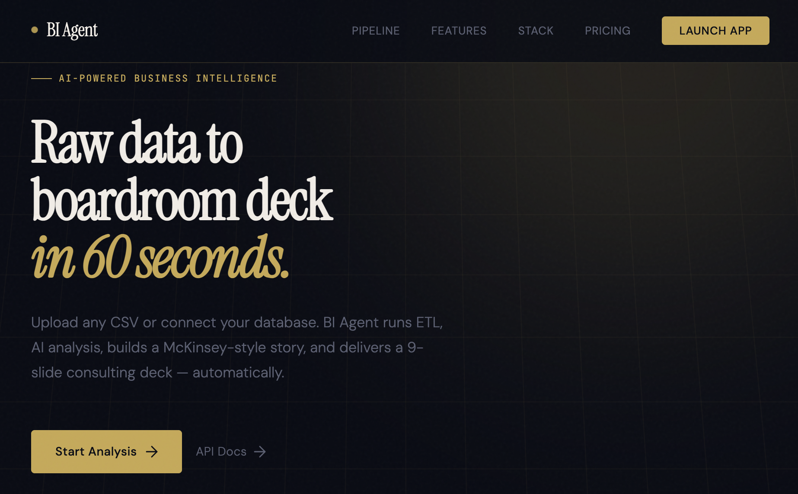

<div align="center">

# ⚡ BI Agent

### AI-Powered Business Intelligence — From Raw Data to Boardroom Decks

<p align="center">
  
</p>

[](https://python.org)
[](https://fastapi.tiangolo.com)
[](https://nodejs.org)
[](https://docker.com)
[](https://streamlit.io)
[](LICENSE)

<br/>

> **Upload a CSV or connect your company database.**  
> BI Agent runs ETL, AI analysis, builds a McKinsey-style story,  
> and delivers a 9-slide consulting deck — automatically, in under 60 seconds.

<br/>

```
┌─────────────────────────────────────────────────────────────────┐
│  Raw Data  →  ETL  →  AI  →  SCR Story  →  Consulting Deck     │
│  (CSV / SQL)           (Ollama · Gemini · Claude)   (PPTX · PDF) │
└─────────────────────────────────────────────────────────────────┘
```

</div>

---

## 🏗️ System Architecture

```
┌──────────────────────────────────────────────────────────────────────────┐
│                          TWO INGESTION MODES                             │
├────────────────────────────┬─────────────────────────────────────────────┤
│   MODE A — CSV Upload      │        MODE B — SQL Auto-Sync               │
│   (Instant, manual)        │        (Scheduled, zero-touch)              │
│                            │                                             │
│   User → Streamlit UI      │   ┌──────────────────────────────┐          │
│        → Upload CSV        │   │     Company Server           │          │
│        → Run Pipeline      │   │                              │          │
│        → Download PPTX     │   │  PostgreSQL / MySQL          │          │
│                            │   │       ↓ query                │          │
│                            │   │  Docker Agent                │          │
│                            │   │  (connector.py)              │          │
│                            │   │       ↓ HTTPS + API Key      │          │
│                            │   └──────────────────────────────┘          │
└────────────┬───────────────┴──────────────────────┬────────────────────┘
             └──────────────────┬───────────────────┘
                                ↓
┌──────────────────────────────────────────────────────────────────────────┐
│                        FASTAPI BACKEND                                   │
│                                                                          │
│  ① INGESTION         routers/ingest.py                                   │
│    Validate → Create Job ID → Store in job_store                        │
│                                ↓                                        │
│  ② ETL               services/cleaner.py                                 │
│    Remove nulls · Dedup · Normalize · Detect types · Quality Score 0-100 │
│                                ↓                                        │
│  ③ AI ANALYSIS        routers/analyze.py                                 │
│    ┌─────────────────────────────────────┐                               │
│    │  AI Provider (configured via .env)  │                               │
│    │  Ollama (local) · Gemini · Claude   │                               │
│    └─────────────────────────────────────┘                               │
│    Output: key_insights · anomalies · recommendations · charts_config   │
│                                ↓                                        │
│  ④ CONSULTING ENGINE  services/consulting_brain.py                       │
│    McKinsey SCR Framework:                                               │
│    Situation → Complication → Resolution                                 │
│    + Impact/Effort matrix · Quick wins · 30/60/90-day roadmap           │
│                                ↓                                        │
│  ⑤ DESIGN AGENT       services/design_agent.py                          │
│    Auto-selects theme + layout from dataset fingerprint                 │
│    seed = hash(data[:80])  →  deterministic, reproducible design        │
│                                ↓                                        │
│  ⑥ EXPORT             routers/export.py                                  │
│    PPTX via Node.js subprocess · PDF via WeasyPrint                     │
└──────────────────────────────────────────────────────────────────────────┘
                                ↓
         ┌──────────────────────────────────────────┐
         │            OUTPUT                         │
         │                                          │
         │  9-Slide PPTX Consulting Deck            │
         │  Executive PDF Report                    │
         │  Streamlit Interactive Dashboard         │
         │  Saved to /reports/{date}/{company}/     │
         └──────────────────────────────────────────┘
```

---

## 🎯 What Gets Generated

A complete **9-slide McKinsey-style consulting deck**, auto-generated from your data:

| # | Slide | Content |
|---|-------|---------|
| 1 | **Cover** | Company name · Date · Data quality badge |
| 2 | **Executive Summary** | One-sentence key message (SCR format) |
| 3 | **KPI Dashboard** | 4 headline metrics + bar chart |
| 4 | **Key Findings** | Chart left · Top 3 insights right |
| 5 | **Root Cause Analysis** | Anomaly detection + explanation |
| 6 | **Opportunity Assessment** | Quantified upside with evidence |
| 7 | **Strategic Recommendations** | 3 prioritized actions |
| 8 | **Implementation Roadmap** | 30 / 60 / 90-day plan |
| 9 | **Expected Impact** | ROI projection · closing dark slide |

---

## 🧠 AI Design System

**6 themes** auto-selected based on industry + data fingerprint — same data always produces the same design (deterministic seed):

| Theme | Best For | Palette |
|-------|----------|---------|
| `midnight_strategy` | Finance · Banking | Navy + Steel Blue |
| `clean_executive` | General · Operations | Navy + Teal |
| `slate_tech` | Technology · SaaS | Dark Slate + Sky |
| `teal_health` | Healthcare · Pharma | Forest + Teal |
| `warm_neutral` | Retail · FMCG | Warm Gray + Amber |
| `crimson_risk` | Risk · Audit · Compliance | Crimson + Red |

**5 layouts** selected by data structure:

| Layout | Triggers When |
|--------|--------------|
| `pyramid` | General executive audience |
| `dashboard_first` | Highly numeric datasets |
| `story_driven` | Narrative-heavy insights |
| `risk_spotlight` | Anomaly-heavy data |
| `data_intelligence` | Technical / SaaS data |

---

## 🚀 Quick Start

### Prerequisites
- Python 3.11+
- Node.js 18+
- Ollama (local, free) **or** Gemini / Claude API key

### 1. Clone & Install

```bash
git clone https://github.com/your-username/bi-agent.git
cd bi-agent/backend

python -m venv venv
source venv/bin/activate          # Windows: venv\Scripts\activate
pip install -r requirements.txt

cd services && npm install pptxgenjs && cd ..
```

### 2. Configure

```bash
cp .env.example .env
# Set AI_PROVIDER=ollama (or gemini/claude) and add your keys
```

### 3. Run

```bash
# Terminal 1 — API Backend
uvicorn main:app --reload
# → http://localhost:8000/docs

# Terminal 2 — Dashboard UI
cd .. && streamlit run dashboard.py
# → http://localhost:8501

# Terminal 3 — Local AI (if using Ollama)
ollama serve && ollama pull qwen2.5
```

### 4. Generate Your First Deck

1. Open `http://localhost:8501`
2. Upload any CSV
3. Click **Run Full Pipeline**
4. Download your PPTX in ~30 seconds

---

## 🐳 Docker Agent — Zero-Touch SQL Sync

For automatic daily reports from your company database — no manual uploads ever again.

### Setup

```yaml
# docker/company_agent/config.yaml
database:
  type: postgres          # or mysql
  host: your-db-host
  port: 5432
  name: your_database
  username: readonly_user
  password: your_password

agent:
  api_url: https://your-bi-agent.railway.app
  api_key: your_secret_key
  tables:
    - sales
    - customers
    - orders
  sync_interval_minutes: 60
```

```bash
cd docker/company_agent
docker build -t bi-agent-connector .
docker run -v $(pwd)/config.yaml:/config/config.yaml bi-agent-connector
```

**Automated flow every morning:**
```
08:00 AM  →  Docker Agent queries company DB
          →  POST /ingest/push (HTTPS + API Key)
          →  ETL + AI Analysis (background, automatic)
          →  PPTX saved to /reports/2026-03-12/CompanyName/
          →  No human needed
```

> **Security:** DB credentials never leave the company server. Only query results are transmitted over HTTPS with API key authentication.

---

## 🌐 API Reference

Full interactive docs at `/docs` after running.

```
# Ingestion
POST  /ingest/upload-csv          Upload CSV file
POST  /ingest/push                Receive data from Docker Agent *
POST  /ingest/connect             Test DB connection
GET   /ingest/jobs/{job_id}       Poll job status

# Pipeline
POST  /pipeline/clean             Run ETL cleaning
POST  /analyze/run                Run AI analysis
GET   /analyze/result/{job_id}    Get analysis JSON

# Export
POST  /export/pptx/{job_id}       Generate 9-slide PPTX
POST  /export/pdf/{job_id}        Generate PDF report
GET   /export/json/{job_id}       Export raw story JSON

* Requires X-API-Key header
```

---

## 🏛️ Project Structure

```
bi-agent/
├── backend/
│   ├── main.py                       # FastAPI app + CORS + router registration
│   ├── requirements.txt
│   ├── .env.example
│   ├── models/
│   │   └── schemas.py                # Pydantic models: Job, Analysis, Report
│   ├── routers/
│   │   ├── ingest.py                 # CSV upload + Docker Agent endpoint
│   │   ├── pipeline.py               # ETL orchestration
│   │   ├── analyze.py                # AI provider routing + call_ai()
│   │   └── export.py                 # PPTX + PDF export via subprocess
│   └── services/
│       ├── cleaner.py                # ETL: dedup, nulls, types, quality score
│       ├── job_store.py              # In-memory job registry
│       ├── auto_pipeline.py          # Background: ETL→AI→Story→PPTX
│       ├── consulting_brain.py       # McKinsey SCR framework + story builder
│       ├── consulting_pipeline.py    # Full pipeline orchestrator
│       ├── slide_builder_v3.js       # PPTX generator (pptxgenjs, Node.js)
│       ├── design_system.py          # 6 themes × 5 layouts + color tokens
│       ├── design_agent.py           # Auto theme/layout selector
│       ├── slide_planner.py          # Slide order + chart planner
│       ├── story_builder.py          # Narrative engine
│       ├── executive_agent.py        # Executive summary generator
│       ├── report_builder.py         # PDF HTML template builder
│       └── db_connector.py           # SQLAlchemy: PostgreSQL + MySQL
├── dashboard.py                      # Streamlit UI (KPI cards, charts, export)
├── fonts/                            # Custom fonts for PDF
├── tests/
└── docker/
    └── company_agent/
        ├── connector.py              # Agent: schedule + query + POST
        ├── config.yaml               # Company DB config (never committed)
        ├── Dockerfile
        └── requirements.txt
```

---

## ⚙️ Environment Variables

```bash
# AI Provider — pick one
AI_PROVIDER=ollama              # ollama | gemini | claude

# Ollama (local, free, private)
OLLAMA_MODEL=qwen2.5:latest
OLLAMA_URL=http://localhost:11434

# Cloud AI (optional)
GEMINI_API_KEY=your_gemini_key
ANTHROPIC_API_KEY=your_claude_key

# Security
AGENT_API_KEY=your_docker_agent_secret

# Output
REPORTS_DIR=./reports
```

---

## 🚢 Deploy on Railway

```bash
# 1. Push to GitHub
git add . && git commit -m "production ready" && git push

# 2. railway.app → New Project → Deploy from GitHub
# 3. Root Directory: backend
# 4. Add environment variables from .env.example
# 5. Deploy → live in ~2 minutes
```

Your API will be live at:
```
https://bi-agent-production.up.railway.app/docs
```

---

## 🛠️ Tech Stack

| Layer | Tech | Why |
|-------|------|-----|
| Backend | FastAPI + Python 3.11 | Async, fast, OpenAPI auto-docs |
| ETL | Pandas + Pydantic | Reliable data cleaning + validation |
| AI | Ollama / Gemini / Claude | Swappable via .env — local or cloud |
| Story | Custom SCR Pipeline | McKinsey-grade consulting narrative |
| Design | 6 Themes × 5 Layouts | Deterministic, industry-aware |
| PPTX | pptxgenjs (Node.js) | Pixel-perfect slide generation |
| PDF | WeasyPrint | HTML/CSS → PDF |
| Dashboard | Streamlit + Plotly | Fast interactive data visualization |
| SQL | SQLAlchemy | PostgreSQL + MySQL abstraction |
| Agent | Docker + Schedule | Zero-touch company data sync |

---

## 📄 License

MIT — free to use, fork, and deploy.

---

<div align="center">

Built with FastAPI · Pandas · pptxgenjs · Streamlit · Ollama

</div>
